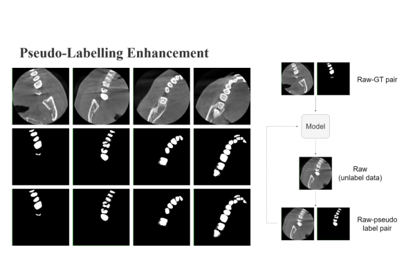
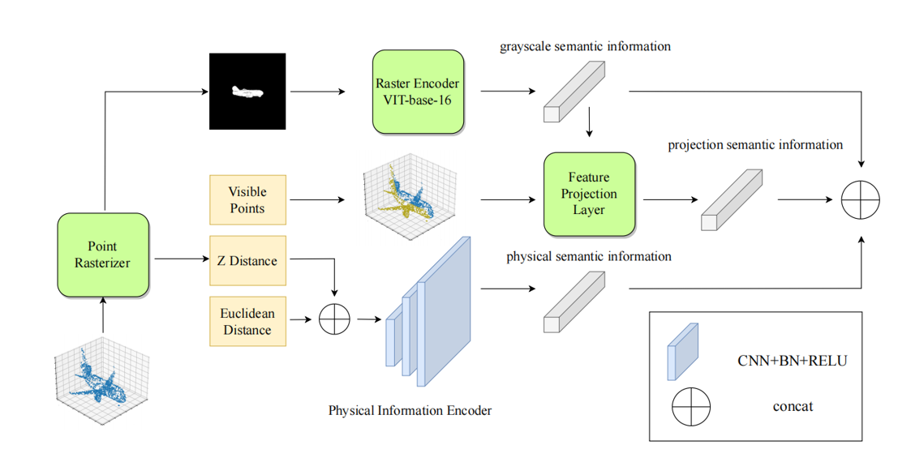

Currently a BSc software engineering student. For more details and project experience, please move to my github repository. 

## Recent research

#### **Automated dental CBCT segmentation using Pseudo Labeling method, MICCAI STS Workshop, Springer LNCS.**

#### Multi-Modal Semantic Communication with Point Cloud Diffusion, ICASSP 2025.

#### 

