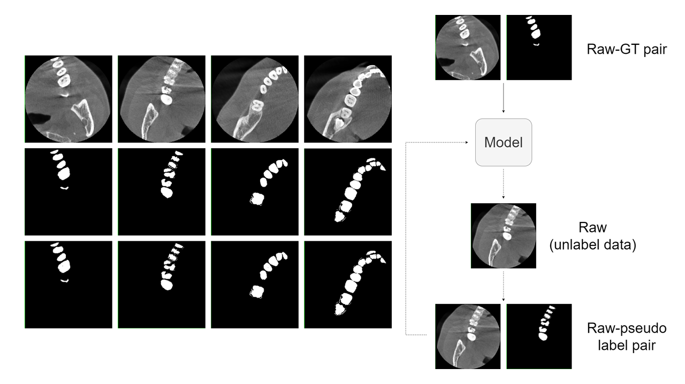

I am currently a Master student of National University of Singapore, Majoring in Artificial Intelligence System.

## Intern research work
### Huya Inc.

## Recent research
### [1] Multi-Modal Semantic Communication with Point Cloud Diffusion, ICASSP 2025.

### [2] Automated dental CBCT segmentation using Pseudo Labeling method, MICCAI STS Workshop, Springer LNCS.

